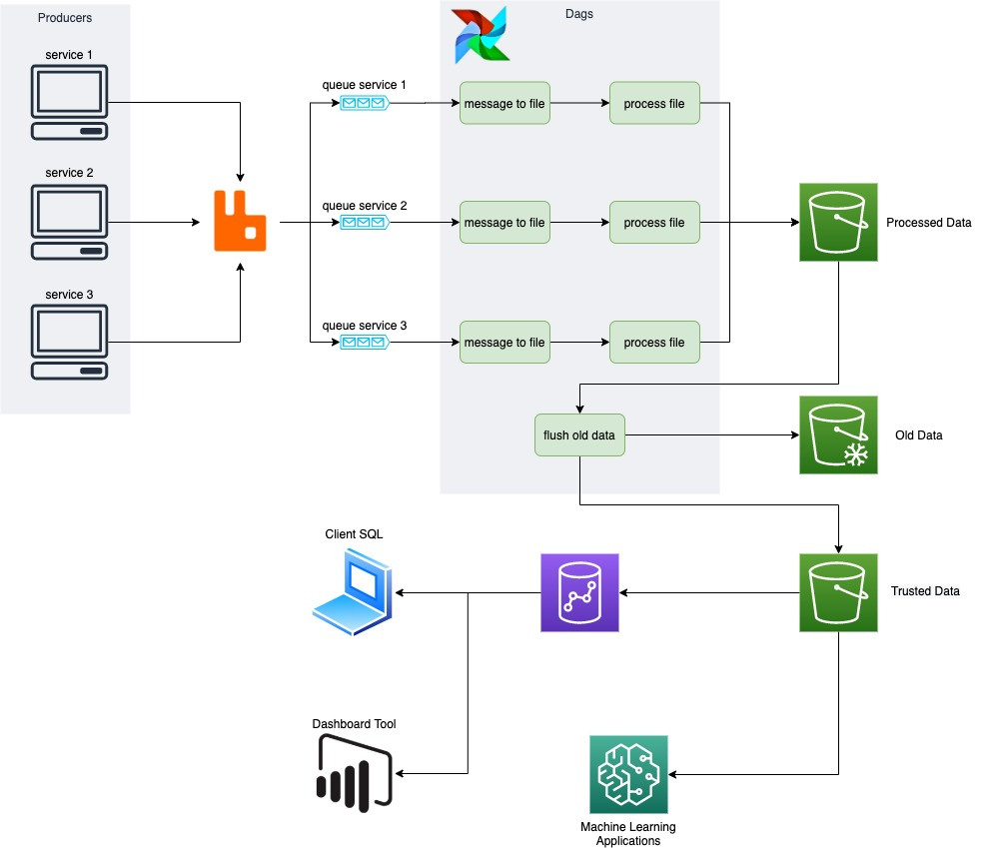
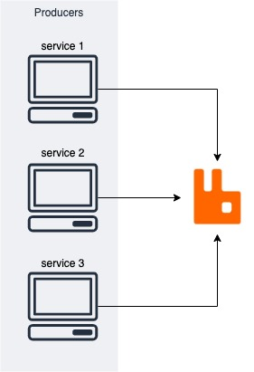
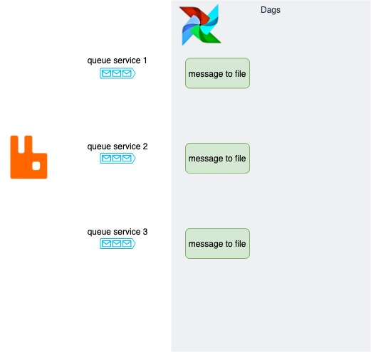
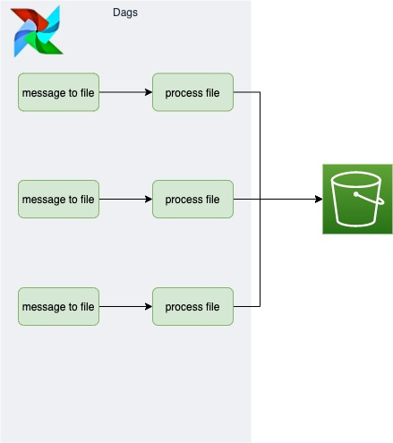
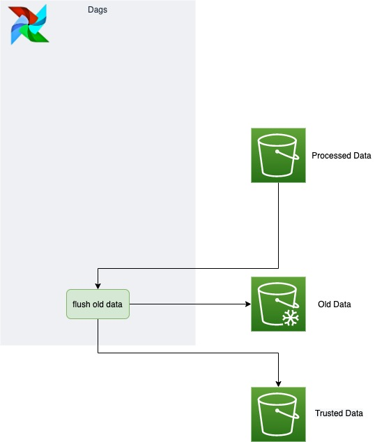
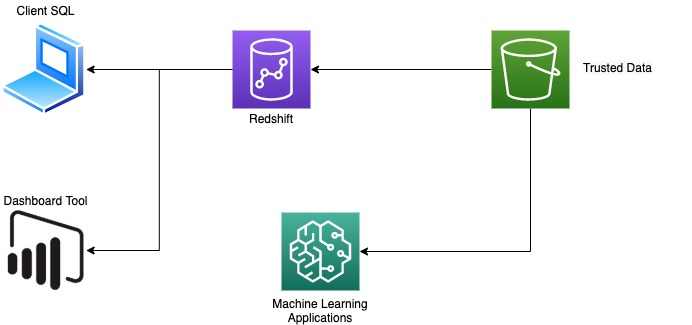

# Proposta de Arquitetura de Dados

Este documento apresenta a organização do serviço de Engenharia de Dados para
processar mensagens e torna-las acessíveis para as respectivas aplicações:
  - Consultas ao Datalake
  - Visualizações de Dados
  - Serviços baseados em Machine Learning

### Premissas

  - As mensagens, que descrevem estados das entidades, serão enviadas de forma
  ordenada
  - Cada microsserviço tem sua própria fila no RabbitMQ
  - Os serviços de Armazenamento e Virtualização dos Arquivos serão da Suite
  de Soluções da AWS, apesar de existirem soluções ou análogas em outros
  fornecedores ou até gratuitas.

## Ingestão

Este passo descreve todo o processo desde a criação da mensagem até o
armazenamento do seu valor literal no S3.

### RabbitMQ

Após a execução de algum serviço, a mensagem de log associada ao serviço é
direcionada ao serviço do RabbitMQ. O RabbitMQ é um serviço que precisa estar
sempre disponível para escutar e armazenar novas mensagens. É importante que
haja um buffer para guardar mensagens em caso de indisponibilidade do servidor
e que as mensagens enfileiradas no RabbitMQ sejam persistidas em memória física.
Assim não perderemos nenhuma mensagem na fonte.

A utilização dos containers de docker podem ajudar na estabilidade do serviço
do RabbitMQ.

### Armazenamento

No Airflow, agendamos o consumo de cada fila do RabbitMQ mensagens. O período
deste agendamento é função da vazão de cada fila.

Neste primeiro consumo faremos apenas o armazenamento bruto das mensagens. É
muito importante manter estas mensagens em arquivos, por ser uma forma de
memória mais barata e por nos possibilitar

Cada endereço de arquivo armazenado é registrado no banco de dados do Airflow
com uma coluna discriminando que arquivos faltam processar e quando foram
gerados para respeitarmos a ordem dos eventos representados pelas mensagens.

## Transformação

Agora que temos armazenado, ordenado e discriminado, podemos invocar um EMR para
as processar cada respectivas transformações para processar os novos arquivos. e
o resultado dessas transformações retorna ao ambiente de armazenamento com o
timestamp do processamento discriminado.

É interessante evitar a criação e deleção de instâncias pela demora do setup
do EMR.

Um fato é interessante ressaltar. Entre microsserviços que não dividem
referências, a ordem não precisa ser preservada. Se existirem serviços com
entidades independentes, podemos não nos preocupar com ordem entre esses
serviços e paralelizar o processamento. Quanto mais processamentos paralelos,
menor a chance de um arquivo virar gargalo.

## Carga

Finalmente, podemos consolidar as versões dos dados. Utilizando rotinas
periódicas, consolidamos os dados incrementais com a última visão dos dados
e realizamos um backup das imagens antigas em armazenamentos menos performáticos
e mais baratos, como Glaciar da AWS.

## Aplicações

Com os dados carregados e consolidados, podemos servir sobre eles diversas
aplicações. Podemos treinar modelos no SageMaker ou no EMR usando o S3
diretamente. Podemos utilizar também o Redshift, Hive, Athena para conseguir
utilizar os arquivos utilizando SQL. Podemos usar inclusive soluções de
Dashboard como Power BI e Tableau. Aqui é importante estudar a compatibilidade
entre as soluções, apesar de serviços como Tableau terem uma lista grande de
conectores.
